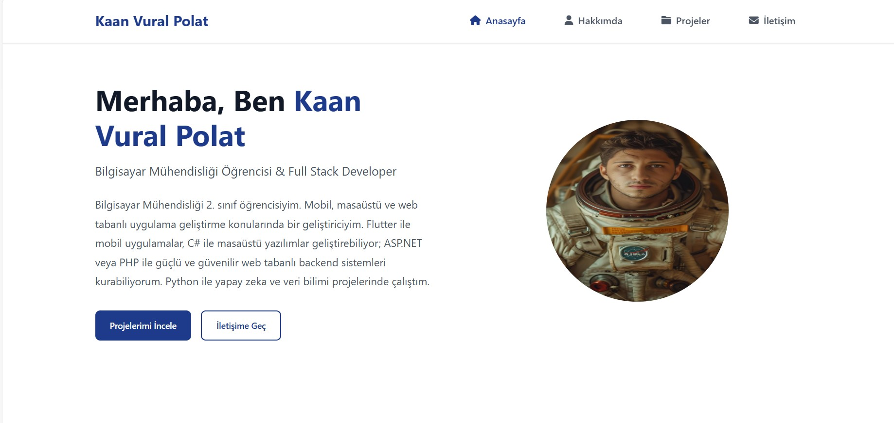

# Kişisel Portfolio Web Sitesi

Bu proje, modern ve responsive bir kişisel portfolio web sitesidir. PHP, JavaScript, HTML ve CSS kullanılarak geliştirilmiştir.

## 🚀 Özellikler

- Responsive tasarım
- Modern ve kullanıcı dostu arayüz
- Proje showcase modalları
- İletişim formu validasyonu
- Smooth scroll animasyonları
- Intersection Observer ile sayfa animasyonları
- Cross-browser uyumluluğu

## 🛠️ Kullanılan Teknolojiler

- PHP 7.0+
- JavaScript (ES6+)
- HTML5
- CSS3
- Font Awesome 6.0
- Intersection Observer API

## 📦 Proje Yapısı

```
PersonalPortfolio/
├── assets/             # Görseller
├── css/               # Stil dosyaları
├── includes/          # PHP include dosyaları
├── js/               # JavaScript dosyaları
├── .idea/            # IDE konfigürasyon dosyaları
├── index.php         # Ana sayfa
├── hakkimda.php      # Hakkımda sayfası
├── projeler.php      # Projeler sayfası
├── iletisim.php      # İletişim sayfası
└── process_contact.php # İletişim formu işleme
```

## ⚙️ Kurulum

1. Projeyi klonlayın:
```bash
git clone https://github.com/username/PersonalPortfolio.git
```

2. Bir PHP sunucusuna yerleştirin (örn: Apache, Nginx)

3. Web tarayıcısından projeye erişin

## 🔧 Geliştirme

Projeyi yerel ortamda çalıştırmak için:

```bash
php -S localhost:5000
```

## 📄 Sayfalar

- **Anasayfa**: Kişisel tanıtım ve özet bilgiler
- **Hakkımda**: Detaylı bilgiler ve yetenekler
- **Projeler**: Portfolio projeleri galerisi
- **İletişim**: İletişim formu ve bilgileri

## 🔒 Güvenlik

- XSS koruması
- Form validasyonu
- Spam koruması
- Güvenli dosya işlemleri

